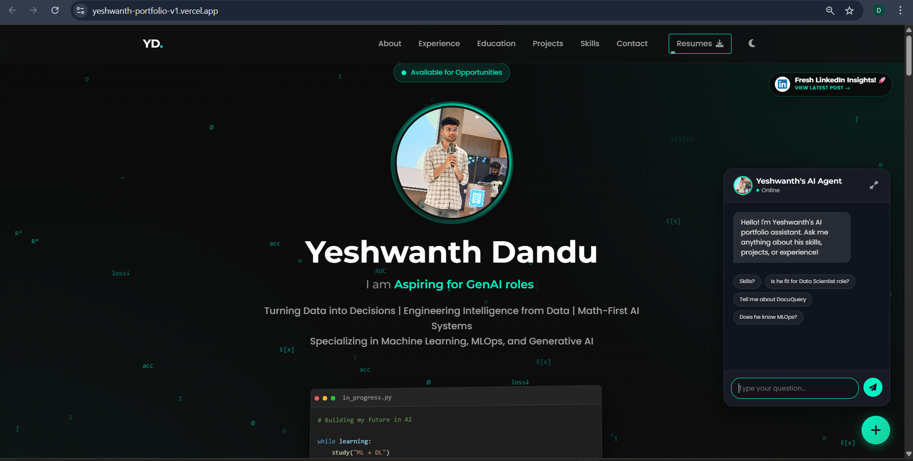

# Yeshwanth Dandu | Data Scientist Portfolio 🚀

Welcome to my personal portfolio! This project features a **modern, responsive frontend** deployed on Vercel and a **powerful RAG AI Backend** deployed on Render, creating an intelligent chatbot that can answer questions about my experience, projects, and skills.



## 🌟 Live Demo

- **Frontend (Portfolio)**: [Deployed on Vercel](https://your-vercel-app-url.vercel.app)
- **Backend (AI Agent)**: [Deployed on Render](https://rag-backend-xv31.onrender.com) (API Service)

---

## 🏗️ System Architecture

This portfolio implements a **full-stack RAG (Retrieval-Augmented Generation)** system with a clean separation between frontend and backend:

```
┌─────────────────────────────────────────────────────────────────┐
│                     CLIENT SIDE (Vercel)                        │
│  ┌───────────────────────────────────────────────────────────┐  │
│  │  Portfolio Website (Static Site)                          │  │
│  │  • HTML5 + CSS3 (Glassmorphism Design)                    │  │
│  │  • Vanilla JavaScript                                     │  │
│  │  • Bootstrap 5                                            │  │
│  │  • Responsive UI with Dark/Light Mode                     │  │
│  └───────────────────────────────────────────────────────────┘  │
│                              ▲                                  │
│                              │ User Interaction                 │
│                              ▼                                  │
│  ┌───────────────────────────────────────────────────────────┐  │
│  │  Chat Interface                                           │  │
│  │  • Sends user queries via HTTPS POST to /chat             │  │
│  │  • Receives AI-generated responses                        │  │
│  └───────────────────────────────────────────────────────────┘  │
└─────────────────────────────────────────────────────────────────┘
                              │
                              │ HTTPS API Calls
                              │ (JSON Request/Response)
                              ▼
┌─────────────────────────────────────────────────────────────────┐
│                    SERVER SIDE (Render)                         │
│  ┌───────────────────────────────────────────────────────────┐  │
│  │  FastAPI Backend (main.py)                                │  │
│  │  • CORS-enabled REST API                                  │  │
│  │  • Endpoints: /, /chat, /linkedin_posts                   │  │
│  │  • Initializes PortfolioAgent on startup                  │  │
│  └───────────────────────────────────────────────────────────┘  │
│                              │                                  │
│                              ▼                                  │
│  ┌───────────────────────────────────────────────────────────┐  │
│  │  RAG Agent (rag_agent.py)                                 │  │
│  │                                                            │  │
│  │  1. Query Processing                                      │  │
│  │     └─ Receives user question                             │  │
│  │                                                            │  │
│  │  2. Context Retrieval (FAISS Vector Store)                │  │
│  │     ├─ Embeddings: BAAI/bge-small-en-v1.5                 │  │
│  │     ├─ Similarity Search (Top-K=6 documents)              │  │
│  │     └─ Retrieves relevant resume/project chunks           │  │
│  │                                                            │  │
│  │  3. Prompt Engineering                                    │  │
│  │     ├─ System Prompt (context_engineering_prompt.md)      │  │
│  │     ├─ Retrieved Context                                  │  │
│  │     └─ User Query                                         │  │
│  │                                                            │  │
│  │  4. LLM Generation (Groq API)                             │  │
│  │     ├─ Model: Llama-3.3-70b-versatile                     │  │
│  │     ├─ Temperature: 0.7                                   │  │
│  │     └─ Max Tokens: 1024                                   │  │
│  │                                                            │  │
│  │  5. Response Formatting                                   │  │
│  │     └─ Clean, plain-text response (no markdown)           │  │
│  └───────────────────────────────────────────────────────────┘  │
│                              │                                  │
│                              ▼                                  │
│  ┌───────────────────────────────────────────────────────────┐  │
│  │  Data Sources                                             │  │
│  │  • FAISS Vector Index (faiss_index/)                      │  │
│  │  • Resume & Portfolio Documents                           │  │
│  │  • Project Descriptions                                   │  │
│  │  • Skills & Experience Data                               │  │
│  └───────────────────────────────────────────────────────────┘  │
└─────────────────────────────────────────────────────────────────┘
```

### Architecture Components Explained

#### **Frontend (Vercel)**
- **Static Site Hosting**: Deployed as a static site for fast loading and zero server costs
- **Modern UI/UX**: Glassmorphism design with smooth animations and responsive layout
- **API Integration**: JavaScript fetch calls to backend `/chat` endpoint
- **Real-time Chat**: Interactive chatbot interface with typing indicators

#### **Backend (Render)**
- **FastAPI Server**: High-performance async Python web framework
- **CORS Configuration**: Allows cross-origin requests from Vercel frontend
- **Lazy Loading**: Vector store loads on first request to reduce cold start time
- **Error Handling**: Graceful fallbacks if RAG system fails to initialize

#### **RAG System Pipeline**
1. **Embedding Model**: Uses `BAAI/bge-small-en-v1.5` via FastEmbed for efficient vector embeddings
2. **Vector Store**: FAISS (Facebook AI Similarity Search) for fast semantic search
3. **Retrieval**: Top-K similarity search retrieves most relevant document chunks
4. **Context Injection**: Retrieved context is injected into the system prompt
5. **LLM Generation**: Groq's Llama-3.3-70b generates contextually-aware responses
6. **Response Delivery**: JSON response sent back to frontend

### Key Features
- ✅ **Intelligent Responses**: RAG ensures answers are grounded in actual portfolio data
- ✅ **Fast Retrieval**: FAISS enables sub-second semantic search
- ✅ **Scalable**: Stateless API design allows horizontal scaling
- ✅ **Cost-Effective**: Free-tier deployments on Vercel + Render
- ✅ **Maintainable**: Clean separation of concerns with modular architecture

## 🛠️ Tech Stack

-   **Frontend**: HTML, CSS (Glassmorphism), JavaScript, Bootstrap 5.
-   **Backend**: Python, FastAPI, LangChain, Groq.
-   **Deployment**: Vercel (UI), Render (API).

## 🚀 Local Development

To run the frontend locally:
1.  Clone the repo.
2.  Open `index.html` in your browser (or use Live Server).
3.  The chat will automatically connect to the **live Render backend**.

(No need to run the Python backend locally unless you are developing it!)

## 📬 Contact

-   **Email**: [yeshwanthdandu2003@gmail.com](mailto:yeshwanthdandu2003@gmail.com)
-   **LinkedIn**: [Yeshwanth Dandu](https://linkedin.com/in/yeshwanthdandu)
-   **GitHub**: [YeshwanthDandu180903](https://github.com/YeshwanthDandu180903)

---
&copy; 2026 Yeshwanth Dandu.
