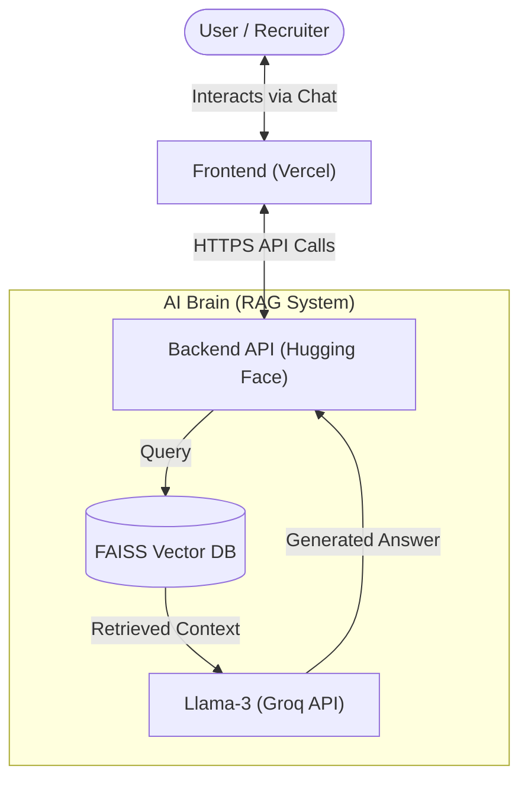

# Yeshwanth Dandu | Next-Gen Data Science Portfolio 🚀

Welcome to my **Next-Gen Portfolio**! This isn't just a static website—it's an **intelligent, AI-powered application** that demonstrates my expertise in **Data Science, Machine Learning, and Generative AI**.

At its core lives a custom-built **RAG (Retrieval-Augmented Generation)** Chatbot capable of answering questions about my experience, projects, and skills in real-time.

---

## 🌟 Live Demo

- **Frontend (Portfolio)**: [Interactive Experience on Vercel](https://dandu-yeshwanth-portfolio.vercel.app)
- **Backend (AI Brain)**: [Powered by Hugging Face Spaces](https://huggingface.co/spaces/yeshu1809/portfolio-backend)

---

## 💡 Why This Portfolio is Different?

As a final-year Data Science student, I wanted to go beyond listing skills—I wanted to **demonstrate them live**. This project showcases:

1.  **Generative AI Engineering**: Building RAG systems from scratch using LangChain & Vector Databases.
2.  **Full-Stack Data Science**: Deploying models as scalable APIs (FastAPI) and connecting them to modern frontends.
3.  **Real-World Application**: Solving the problem of "information retrieval" for recruiters and visitors.

---

## 🏗️ Architecture: How It Works

The system follows a modern **Client-Server-AI** architecture, ensuring low latency and high intelligence.

### 🧠 The RAG Engine (Backend)
Deployed on **Hugging Face Spaces**, the backend powers the intelligent responses:
-   **Ingestion**: Embeds my resume, project docs, and experience using `BAAI/bge-small-en-v1.5`.
-   **Retrieval**: Uses **FAISS** to find the most relevant information for your question.
-   **Generation**: Passes context to **Llama-3-70b** (via Groq) to generate a professional, fact-based answer.

### 🎨 The Interface (Frontend)
Deployed on **Vercel**, the frontend provides a seamless user experience:
-   **Glassmorphism UI**: Modern, clean aesthetic with smooth animations.
-   **Interactive Timeline**: Visualizing my journey from student to professional.
-   **Real-Time Chat**: Direct integration with the AI backend.

---

## 🛠️ Tech Stack

| Component | Technologies Used |
| :--- | :--- |
| **Frontend** | HTML5, CSS3 (Glassmorphism), JavaScript, Vercel |
| **Backend API** | Python, FastAPI, Hugging Face Spaces |
| **AI / LLM** | LangChain, Llama-3 (Groq), FAISS Vector DB |
| **DevOps** | Git, Docker (Hardware-accelerated Space) |

---

## 📬 Connect

-   **LinkedIn**: [Yeshwanth Dandu](https://linkedin.com/in/yeshwanthdandu)
-   **Email**: [yeshwanthdandu2003@gmail.com](mailto:yeshwanthdandu2003@gmail.com)
-   **GitHub**: [YeshwanthDandu180903](https://github.com/YeshwanthDandu180903)

---
&copy; 2026 Yeshwanth Dandu. Building the future with Data & AI.
