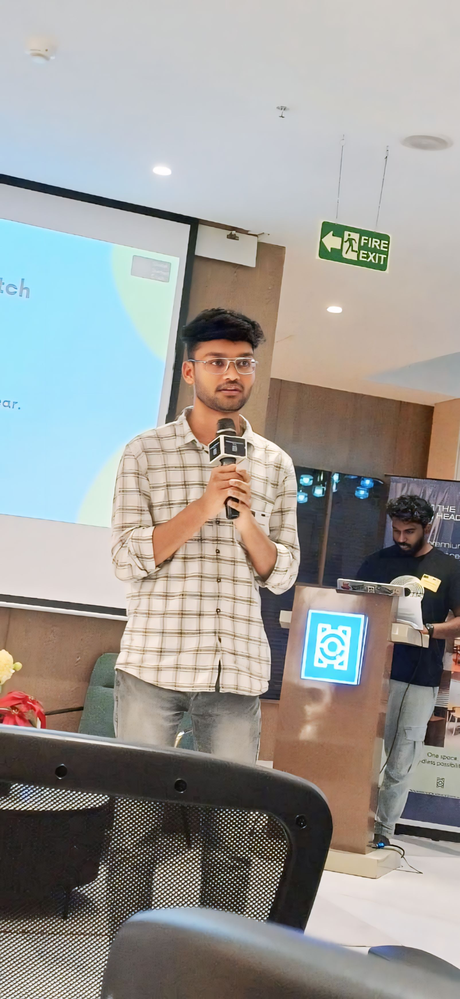

# Yeshwanth Dandu | Data Scientist Portfolio 🚀

Welcome to my personal portfolio functionality! This project features a **modern, responsive frontend** deployed on Vercel and a **powerful RAG AI Backend** deployed on Render.

## 🌟 Live Demo

- **Frontend (Portfolio)**: [Deployed on Vercel](https://your-vercel-app-url.vercel.app)
- **Backend (AI Agent)**: [Deployed on Render](https://rag-backend-xv31.onrender.com) (API Service)

## 🏗️ Architecture

This project uses a standard **Client-Server** architecture:

1.  **Frontend (Vercel)**:
    -   HTML5, CSS3, Vanilla JavaScript.
    -    hosted efficiently as a static site.
    -   Sends user queries to the Backend API.

2.  **Backend (Render)**:
    -   FastAPI (Python) server.
    -   **RAG System**: Uses LangChain & FAISS to retrieve relevant info from my resume/projects.
    -   **LLM**: Connects to Groq (Llama-3) for generating intelligent responses.

## 🛠️ Tech Stack

-   **Frontend**: HTML, CSS (Glassmorphism), JavaScript, Bootstrap 5.
-   **Backend**: Python, FastAPI, LangChain, Groq.
-   **Deployment**: Vercel (UI), Render (API).

## 🚀 Local Development

To run the frontend locally:
1.  Clone the repo.
2.  Open `index.html` in your browser (or use Live Server).
3.  The chat will automatically connect to the **live Render backend**.

(No need to run the Python backend locally unless you are developing it!)

## 📬 Contact

-   **Email**: [yeshwanthdandu2003@gmail.com](mailto:yeshwanthdandu2003@gmail.com)
-   **LinkedIn**: [Yeshwanth Dandu](https://linkedin.com/in/yeshwanthdandu)
-   **GitHub**: [YeshwanthDandu180903](https://github.com/YeshwanthDandu180903)

---
&copy; 2026 Yeshwanth Dandu.
